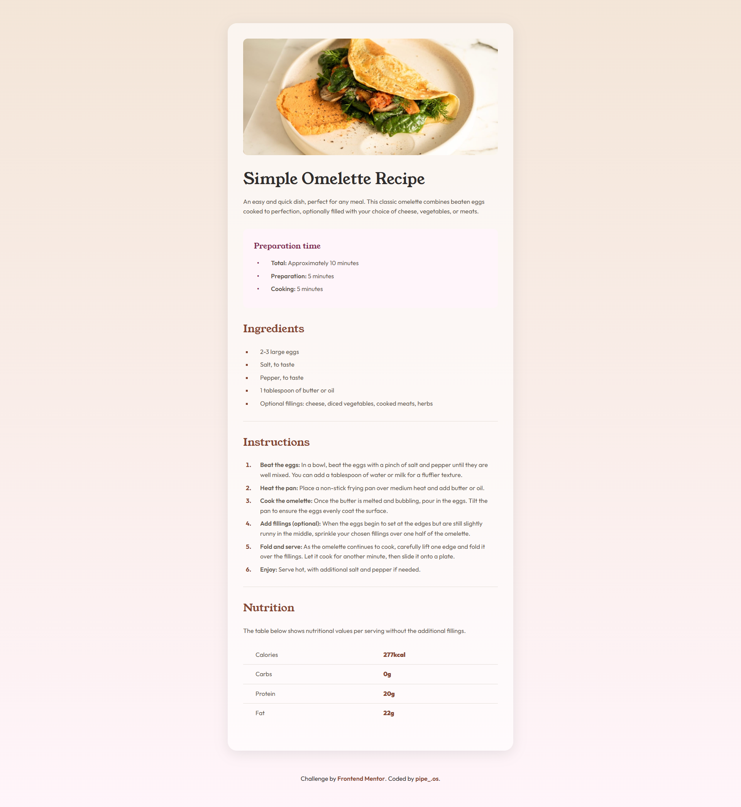

# Frontend Mentor - Recipe page solution

This is my solution to the [Recipe page challenge on Frontend Mentor](https://www.frontendmentor.io/challenges/recipe-page-KiTsR8QQKm).

## Table of contents

- [Overview](#overview)
  - [The challenge](#the-challenge)
  - [Screenshot](#screenshot)
  - [Links](#links)
- [My process](#my-process)
  - [Built with](#built-with)
  - [What I learned](#what-i-learned)

## Overview

### The challenge

Building a webpage that replicates the provided design, using semantic HTML and CSS to style elements such as the image, ingredient and instruction lists, and the nutrition table. The fonts and colors specified in the style guide were applied.

### Screenshot

### Live Site

- Live Site URL: [https://pipe1os.github.io/Recipe-page-frontend-mentor](https://pipe1os.github.io/Recipe-page-frontend-mentor/)

## My process

I started by structuring the content semantically using HTML, based on the provided design. Then, I gradually applied CSS styles, first setting up custom fonts, color variables, and base styles. After that, I focused on the overall layout using Flexbox and designed the main recipe card. Step by step, I styled each section (preparation time, ingredients, instructions, and nutrition) by following the style guide and using the design image as my main reference. Finally, I added personal touches like gradients and shadows to enhance the visual appearance.

### Built with

- **Semantic HTML5 markup:** Used for structuring the content with appropriate tags like `<main>`, `<section>`, `<h1>`-`<h3>`, `<ul>`, `<ol>`, `<li>`, `<table>`, etc., ensuring accessibility and SEO benefits.
- **CSS3:** Applied for styling and visual presentation, including:
  - **CSS Custom Properties:** For efficient management and consistency of colors and other design tokens.
  - **Flexbox:** Utilized for layout control and alignment of key elements.
  - **Custom Fonts (`@font-face`):** Integration of 'Young Serif' and 'Outfit' for specific typography.
  - **Gradients:** Applied `linear-gradient` for the `body` background.
  - **Responsive Design:** Implemented using Media Queries (`@media`) to adapt the layout for different screen sizes, primarily mobile-first.
- **Git:** Used for version control throughout the development process.

### What I learned

During this project, I strengthened my skills in semantic HTML markup and CSS styling. I practiced using CSS Custom Properties to manage colors and fonts more efficiently. I also used Flexbox to center content and structure the card layout. It was a great exercise in closely following a style guide and a specific design, with careful attention to details like spacing, typography, and colors.
